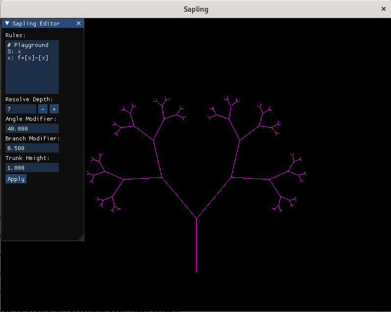
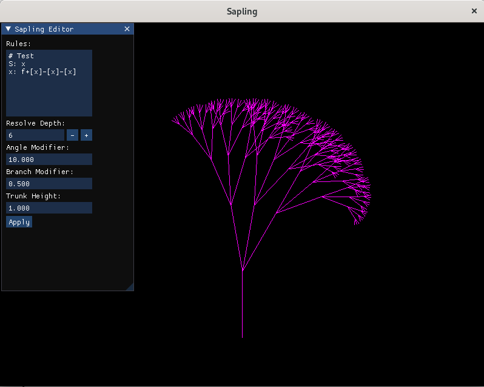

# Midphase Update

## Completed Work
- OpenGL/GLFW utility library has been created
  - Handles shader compilation and gathers available uniforms per program (i.e. uniforms are not hardcoded into the library)
  - Provides management and commands for Vertex Array Objects, Vertex Buffer Objects, Element Buffer Objects, and Texture Buffers (may additionally add Framebuffer management as well)
  - Has a camera class with both orthographic and perspective projections
  - Has a Window class (with proper handling of window resizing)
  - Incorporates Dear::ImGui, an immediate mode GUI library to easily create GUI's as needed
- L-System Parser
  - Created an L-System parser where a file or string that defines an L-System can be parsed into rules
  - Core functionality comes from its Resolve() function, which generates an expanded string of the L-System to a specified depth
  - This is a grammer agnostic parser, it doesn't care about the function of each symbol, but just how the symbol resolves to a given production
- Tree Generator
  - This provides a mapping from a resolved L-System string to generated points that make up the graphical tree (mesh generation is not done here)
  - This is currently only handles 2D
- GUI Editor
  - Added a GUI editor to allow for altering the L-System and modifying the parameters of the tree generator during runtime to allow for L-System exploration
  
## Results
#### Example Tree Generation of Two Different L-Systems within the same runtime

## Future Work
- The next step is to adapt the tree generator to 3D. This means providing a system that can handle rotations across different axis and to consider branch circumference as well.
- This work then needs to be moved to utilize compute shaders (possibly)
  - It may be the case that compute shaders will be better at handling the mesh generation than finding the initial vertex positions since that is a relatively serial process
- Stochastic or parameterized L-Systems may be explored to create more realistic looking trees
- Texture generation will then be added
- Forest generation may then be added at this time

## Revised Timeline
- Currently the project is right on schedule with no known roadblocks, so the original timeline will be followed.