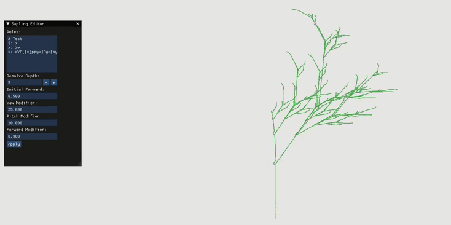

## User Manual

### Program Description
This program provides a sandbox for tree generation using L-Systems. It is composed
of an L-System parser and small OpenGL graphics library.

#### Program Input
There are no required inputs to this program. A default L-System
is provided in the Systems folder. However, this can be overriden by providing a path
to another L-System definition as a command line argument

User input events include mouse wheel scrolling for zooming and right mouse button clicking for rotating the tree.

The GUI allows for modifying the tree configuration parameters and the L-System composed of the
tokens shown below. See the following to understand the effects of changing such variables.

##### Tree Configuration Parameters
 - Initial thickness - The radius of the trunk
 - Initial forward movement amount - How far to move forward initially
 - Thickness modifier - How much to shrink the radius by
 - Yaw modifier in degrees - How much to modify the yaw rotation amount by
 - Pitch modifier in degrees - How much to modify the pitch rotation amount by
 - Forward modifier - How much to modify the forward movement amount
 - Curviture - How curvy the branch should be

##### L-System Tokens
 - x: This is the control token. Typically used for controlling recursion.
 - >: Step forward in the given direction
 - l: Reduce the forward amount
 - L: Increase the forward amount
 - [: Push the current state onto the stack
 - ]: Pop the current state from the stack
 - Y: Turn counter clockwise
 - y: Turn clockwise
 - P: Pitch up
 - p: Pitch down
 - T: Increase thickness
 - t: Decrease thickness

#### Nominal Program Output
Program output should display a GUI for L-System manipulation and the generated tree.

 /

#### Program Exception Output
An off-nominal program output may occur with an incorrect System filepath. All other exceptions are driven by libgraphics. 

#### Program Command Sequence
By default Sapling will run initially with the test L-System. This can be modified during program execution.
To run Sapling with a different L-System, supply the path to the L-System as a command-line argument:`./Sapling path/file.txt`
See the information about the L-System to understand how modifications in the sandbox can affect tree generation.

Use the scroll wheel to zoom in/out.
Use the left click button to rotate the tree.

## Author Information
Tyler Hanf
(603)404-0599
tyler.hanf21@gmail.com