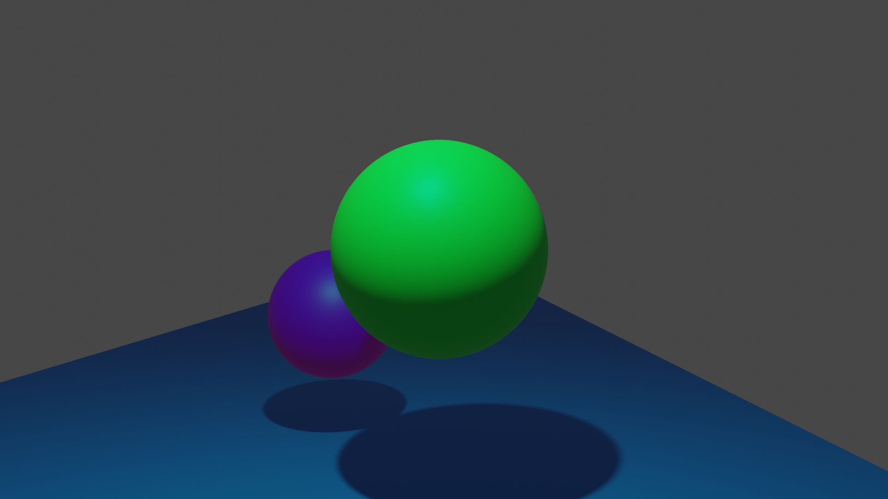
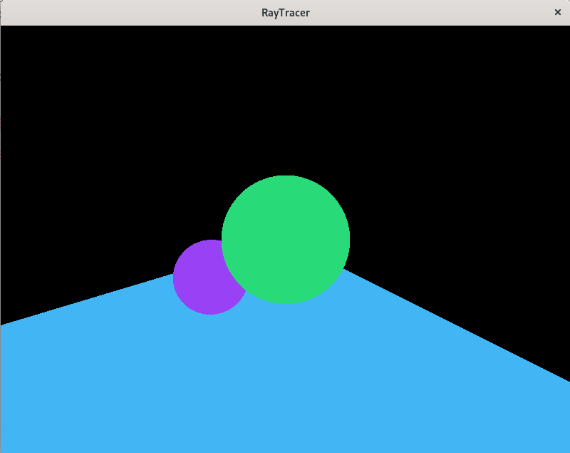

# Checkpoint 1

This was made in Blender to get initial values for the scene.

### Scene Settings
- **Camera** 
  - FOV: 60
  - Position: (0.5, -5, 3)
  - Rotation: (0, 0, 0)
  - Near Plane: 0.1
  - Look-At: (0.5, 2, 3)
  - Aspect: 1
- **Light**
  - Position: (-0.1, -1, 7)
  - Power in picture: 1000 W
  - Radius: 0.1
- **Plane**
  - Position: (-1.5, 30, 0)
  - Scale: (10, 32, 1) 
- **Purple Sphere**
  - Position: (-1.5, 5, 2)
  - Scale: (1, 1, 1)
- **Green Sphere**
  - Position: (0.5, 2, 3)
  - Scale: (1.2, 1.2, 1.2)
### Scene Setup in OpenGL
\
Using the values above, the scene was also setup in OpenGL (no lighting). For a simple mapping, the y and -z values are swapped in the values above due to OpenGL's preferred orientation.