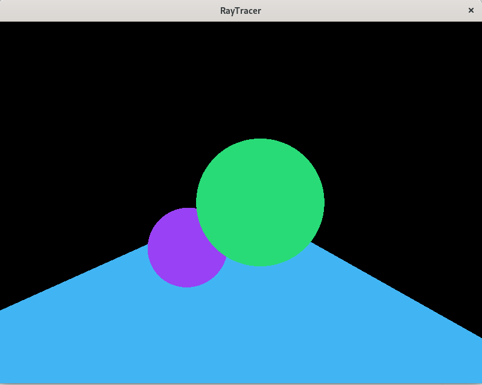
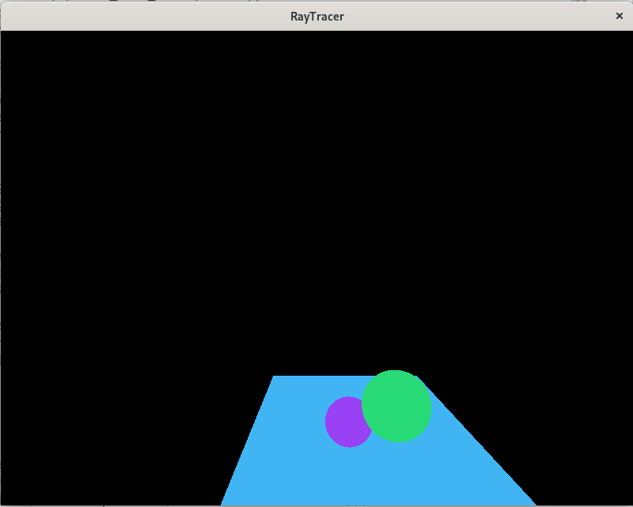

# Checkpoint 2
\
Basic Raycast Implementation. To use modern OpenGL for this project, the scene is rendered into a texture and then the texture is rendered on a quad.
### Bonus
 \
Bonus showing a different perspective.