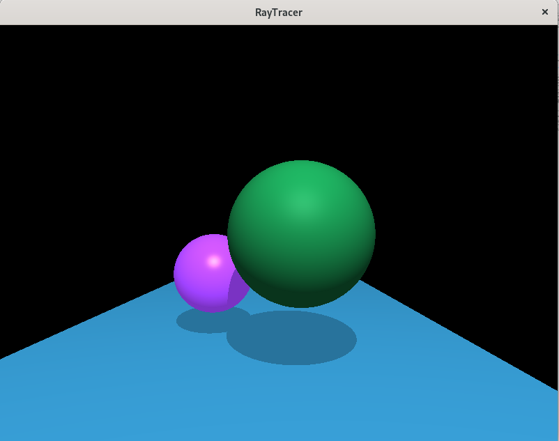
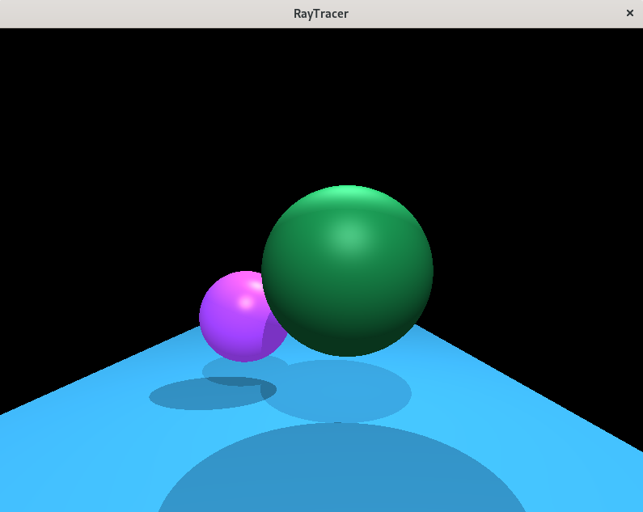

# Checkpoint 3
\

### Bonus
 \
Bonus showing multiple lights. The additional light is placed opposite the camera on the backside of the spheres. The specular value of the green sphere was increased slightly to better show both lights hitting it.

 \
Bonus using a Blinn-Phong shading implementation.