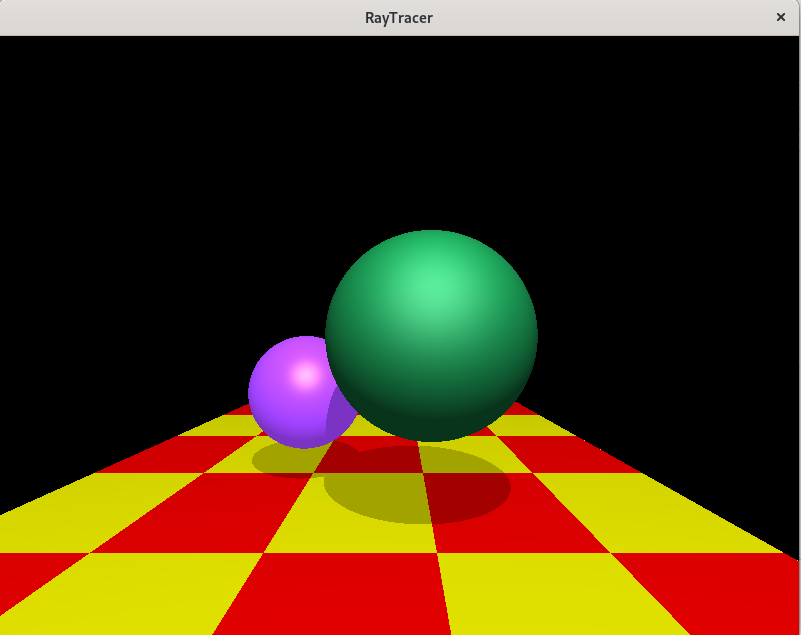
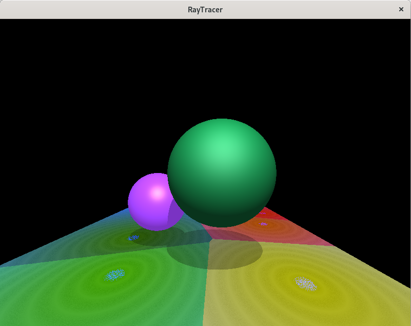

# Checkpoint 4

 \
Basic Checkpoint 4 Render showing procedural texture implementation.

### Bonus
 \
Bonus showing procedurally generated texture based off of Voronoi Diagrams with added noise and circles.