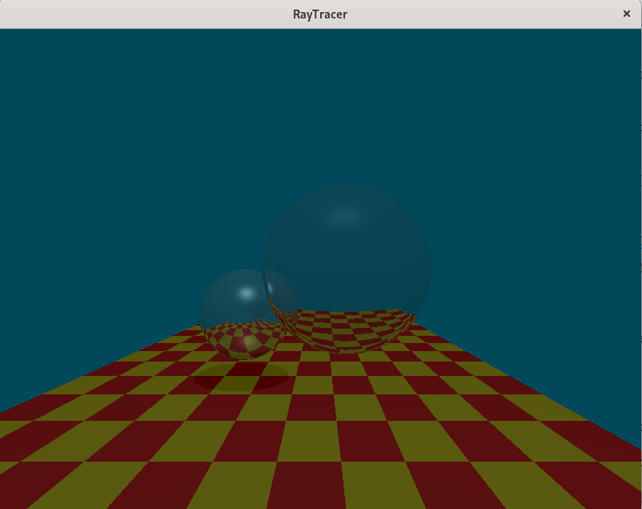
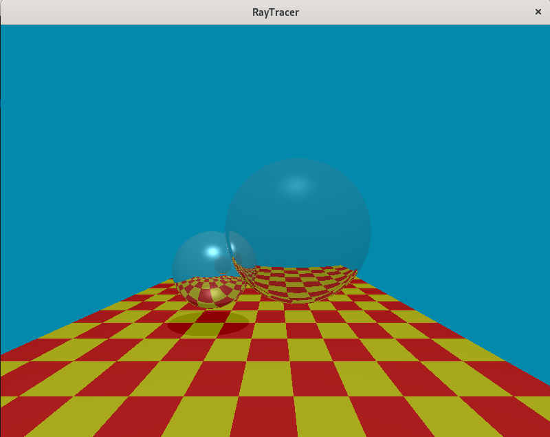
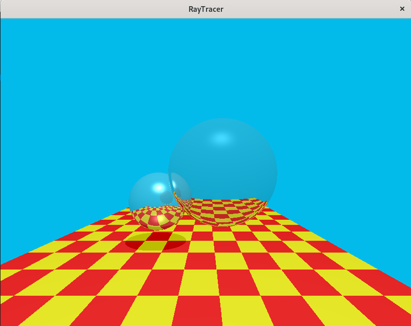
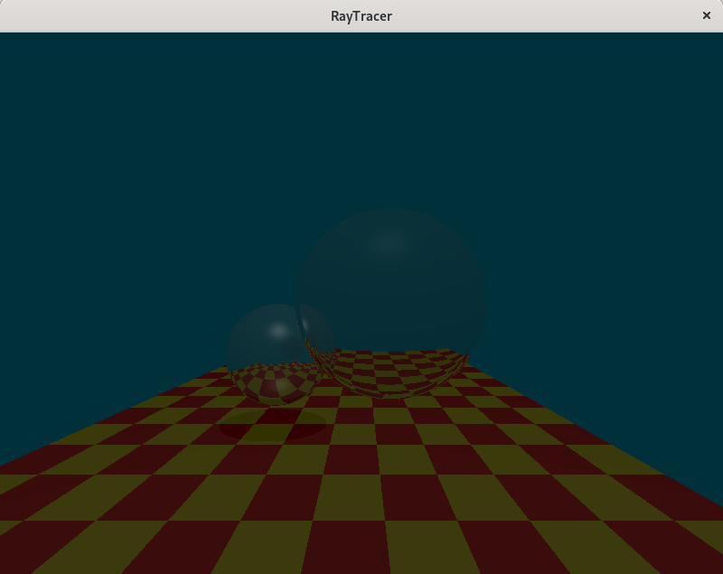
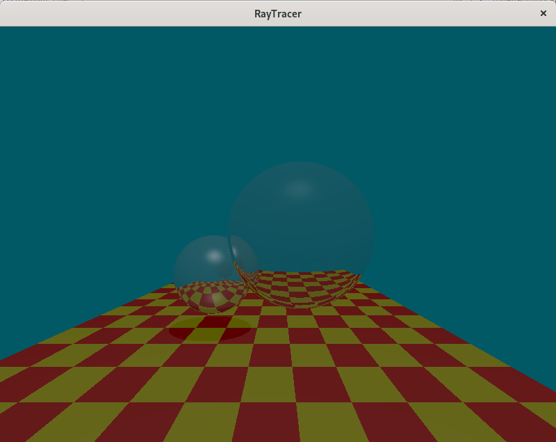
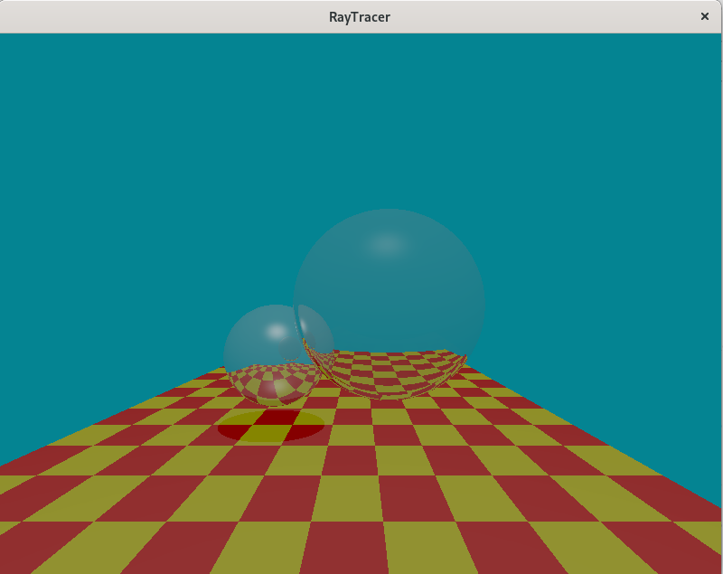

# Checkpoint 7

 \

Ward Operator LMax of 10 nits

 \

Ward Operator LMax of 100 nits

 \

Ward Operator LMax of 1000 nits

 \

Reinhard Operator LMax of 10 nits

 \

Reinhard Operator LMax of 100 nits

 \

Reinhard Operator LMax of 1000 nits

 \

Bonus Reinhard Operator Key Value of 0.40

 \

Bonus Reinhard Operator Key Value of 0.80